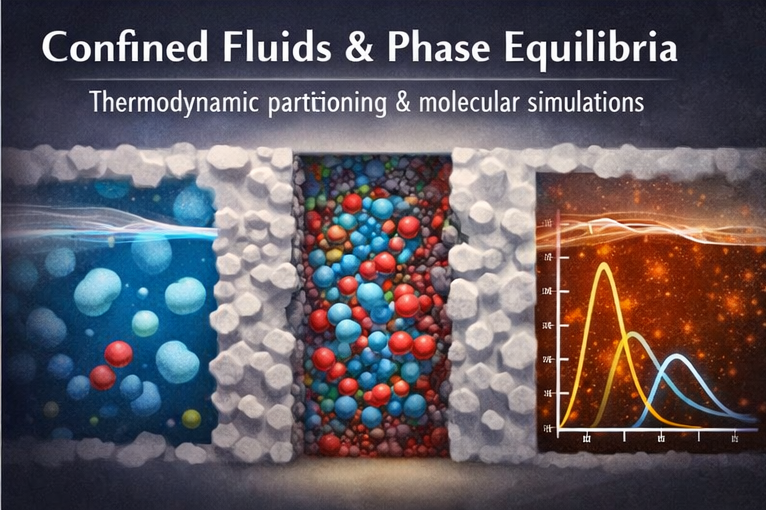

Quantifying thermodynamic partitioning and equilibrium behavior of binary mixtures between bulk and confined phases using molecular simulations.

<figure style="text-align: center;">
    
</figure>

## Related Publications

:::{#pubs}
:::
