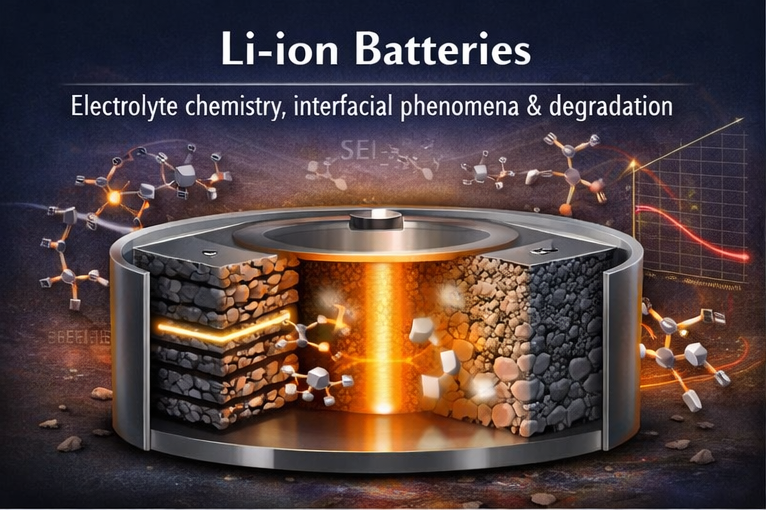

Investigating electrolyte chemistry, interfacial phenomena, and degradation mechanisms that govern performance and stability in Li-ion batteries. 

<figure style="text-align: center;">
    
</figure>

## Related Publications

:::{#pubs}
:::
