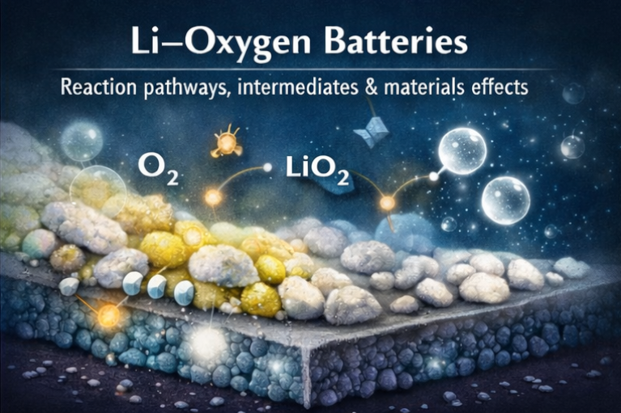

Elucidating reaction pathways, intermediate species, and materials effects that control efficiency and reversibility in lithium–oxygen systems.

<figure style="text-align: center;">
    
</figure>

## Related Publications

:::{#pubs}
:::
