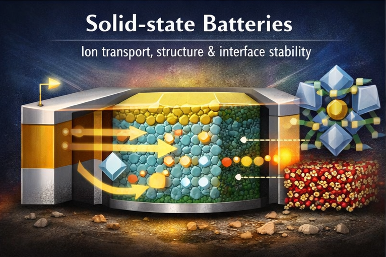

Studying ion transport, structure–property relationships, and interface stability in inorganic and composite solid electrolytes for next-generation batteries. 

<figure style="text-align: center;">
    
</figure>

## Related Publications

:::{#pubs}
:::
